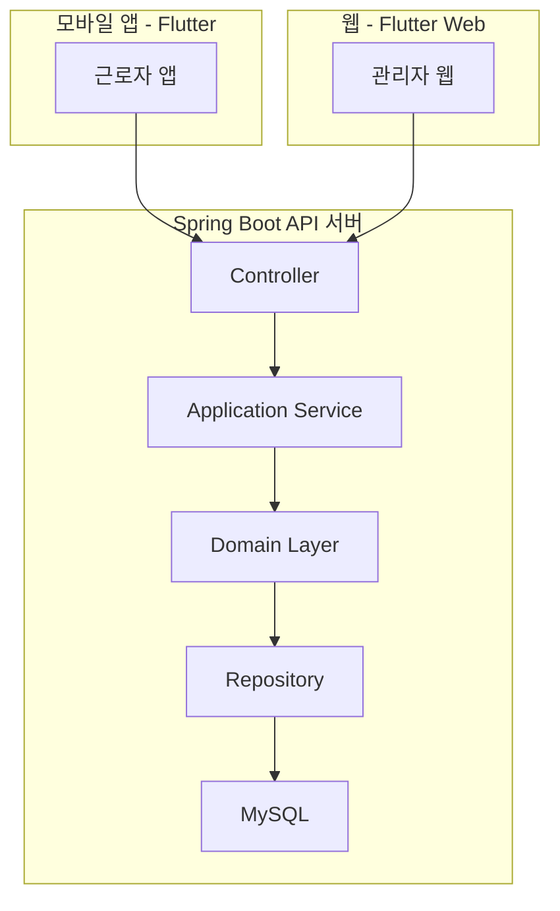

# PRD – 매장 근로자 출퇴근 및 급여 산정 시스템

## 1. 개요
의류 및 신발 매장의 근로자(정규직, 비정규직, 파트타임)의  
출퇴근, 근무 일정, 휴가(연차/반차), 급여 산정을 통합 관리하는 시스템이다.

본 시스템은 **슈퍼 관리자 – 매니저 – 근로자**의 역할을 명확히 구분하며,  
근로자는 모바일 앱을 통해 출퇴근 및 근로 이력을 관리하고,  
관리자는 웹 기반 어드민을 통해 매장 운영 전반을 관리한다.

DDD(Domain-Driven Design) 개념을 수용하여 확장성과 유지보수성을 확보한다.

---

## 2. 사용자 역할 정의

### 2.1 슈퍼 관리자 (Super Admin)
- 전체 매장 관리
- 매장 및 매니저 등록/관리
- 근로 정책 관리
    - 급여 계산 방식
    - 평일/야간/주말 가산율
    - 직급별 연차 정책
- 시스템 전반 설정 관리

---

### 2.2 매니저 (Store Manager)
- 특정 매장 소속
- 근로자 관리
    - 등록 / 수정 / 비활성화
- 근로자 스케줄 관리
- 근로자 출퇴근 기록 검토 및 조정
- 휴가(연차/반차) 신청 승인/반려
- 급여 산정 결과 확인

---

### 2.3 근로자 (Employee)
- 유형
    - 정규 직원
    - 비정규 직원
    - 파트타임 직원
- 앱 로그인 후 출근/퇴근 처리
- 본인 근무 일정 조회
- 연차/반차/휴일 신청 및 취소
- 본인 근로 이력 및 급여 내역 조회

---

## 3. 기능 요구사항

### 3.1 출퇴근 관리
- 근로자는 앱을 통해 출근/퇴근 버튼으로 기록
- 출퇴근 시 로그인 필수
- 매장 단위 출퇴근 제한 가능 (옵션)
- 관리자는 출퇴근 기록을 수정 가능
- 수정 이력은 로그로 남김

---

### 3.2 근무 일정 관리
- 슈퍼 관리자 또는 매니저가 근무 일정 설정
- 근무 일정은 날짜 + 시작/종료 시간 기준
- 근로자 유형별 스케줄 차등 관리 가능
- 근로자는 본인 스케줄 조회 가능

---

### 3.3 휴가 / 연차 관리
- 휴가 유형
    - 연차
    - 반차
    - 휴일
- 직급별 연차 일수 정책 존재
- 근로자는 앱에서 휴가 신청/취소
- 매니저는 승인/반려 처리
- 승인된 휴가는 급여 산정 시 반영

---

### 3.4 급여 산정
- 급여 산정 방식
    - 일 단위
    - 시간 단위
- 근무 유형별 가산율 적용
    - 평일
    - 야간
    - 주말
    - 공휴일
- 가산율은 슈퍼 관리자가 설정
- 급여 산정 결과는 근로자/관리자 모두 조회 가능

---

### 3.5 관리자 웹 (어드민)
- 매장 관리
- 근로자 관리
- 근무 일정 관리
- 출퇴근 기록 관리
- 휴가 승인/반려
- 급여 산정 및 지급 관리
- 정책 관리 (급여, 연차, 가산율)

---

## 4. 비기능 요구사항

### 4.1 기술 스택
- Backend
    - Spring Boot 3.5+
    - Kotlin
    - MySQL
- Frontend
    - Flutter (iOS / Android)
    - Flutter Web (관리자 웹)
- 인증/인가
    - JWT 기반 인증
    - Role Based Access Control (RBAC)

---

### 4.2 품질 속성
- 멀티 매장 지원
- 대규모 근로자 수 확장 가능
- 데이터 변경 이력 추적
- 장애 발생 시 급여 데이터 무결성 보장

---

## 5. 도메인 모델 (DDD 초안)

### 5.1 Employee (근로자)
- 속성
    - employeeId
    - name
    - employeeType (정규/비정규/파트)
    - storeId
    - remainingLeave
- 행위
    - checkIn()
    - checkOut()
    - requestLeave()

---

### 5.2 Store (매장)
- 속성
    - storeId
    - name
    - location
- 행위
    - assignEmployee()
    - createSchedule()

---

### 5.3 WorkSchedule (근무 일정)
- 속성
    - scheduleId
    - employeeId
    - workDate
    - startTime
    - endTime

---

### 5.4 AttendanceRecord (출퇴근 기록)
- 속성
    - recordId
    - employeeId
    - checkInTime
    - checkOutTime
    - adjusted
- 행위
    - adjustRecord()

---

### 5.5 LeaveRequest (휴가)
- 속성
    - leaveId
    - employeeId
    - leaveType
    - status (REQUESTED / APPROVED / REJECTED)
- 행위
    - approve()
    - reject()

---

### 5.6 Payroll (급여)
- 속성
    - payrollId
    - employeeId
    - period
    - amount
- 행위
    - calculate()

---

## 6. 주요 유스케이스

1. 근로자가 앱에서 출근 버튼 클릭
2. 근로자가 퇴근 버튼 클릭 → 근무 시간 계산
3. 근로자가 연차 신청
4. 매니저가 연차 승인/반려
5. 매니저가 출퇴근 기록 수정
6. 슈퍼 관리자가 급여 가산율 변경
7. 급여 산정 배치 실행
8. 근로자가 급여 내역 확인

---

## 7. 시스템 아키텍처

## 8. 향후 확장 고려사항

외부 급여/회계 시스템 연동

위치 기반 출퇴근 (GPS, Beacon)

BI 대시보드 제공

HR 관리 시스템 확장